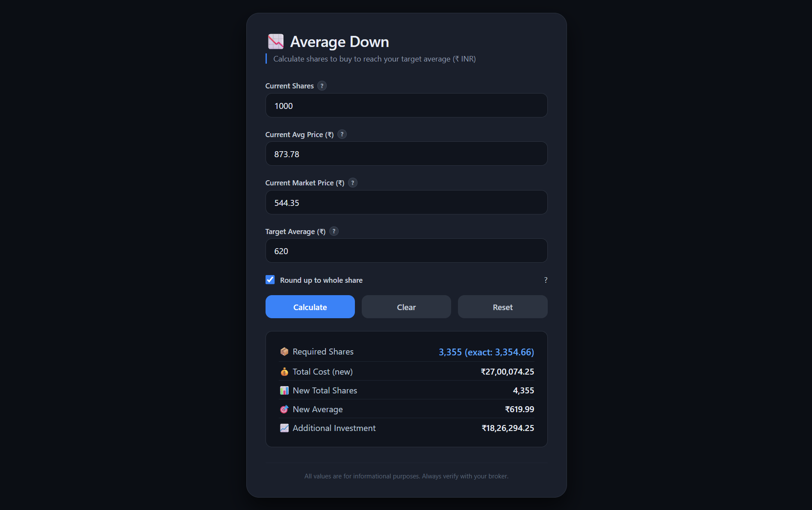

# 📉 Stock Price Average Down Calculator (INR)

A simple, self‑contained single‑page web application that calculates exactly how many additional shares you need to buy in order to reach your target average price. Designed for Indian investors, it displays all monetary values in **₹ (INR)** with Indian‑style comma separators (lakh, crore).

Perfect for averaging down your holdings – just enter your current position, the current market price, and your desired average, and the tool instantly tells you the required quantity.

  
*(Add a screenshot of the tool here if you like)*

---

## ✨ Features

- **Accurate calculation** – based on the standard formula for weighted average.
- **Always whole shares** – automatically rounds up to the next integer because you can’t buy fractional shares (optional – you can turn rounding off to see the exact value).
- **Indian Rupee formatting** – all money values use the `₹` symbol and Indian grouping (e.g., `₹1,23,45,678.90`).
- **Dark theme** – easy on the eyes, works well in any lighting.
- **Tooltips** – hover the **?** icon next to each input to get a clear explanation of what that field means.
- **One‑click actions** – **Calculate**, **Clear** all fields, and **Reset** to the default example values.
- **Keyboard friendly** – press `Enter` to calculate after typing.
- **Self‑contained** – everything (HTML, CSS, JS) is in a single file. No external libraries or dependencies.
- **Responsive** – works on desktop, tablet, and mobile.

---

## 🧮 How It Works

The tool uses the weighted average formula:

```
Required Shares = (Current Shares × (Target Average – Current Average)) / (Current Price – Target Average)
```

Where:
- `Current Shares` – number of shares you already own.
- `Current Average` – your average purchase price per share.
- `Current Price` – the current market price per share.
- `Target Average` – the average price you want to achieve.

If the result is positive, you need to buy that many shares at the current price.  
If it’s negative, the target is not achievable by buying more (you would need to sell shares instead).

> **Note:** The calculator assumes you are buying at the *current market price*.  
> If the current price equals the target price, buying more will not change your average, unless your average already equals the target.

---

## 🚀 Usage

1. **Download** the `index.html` file from this repository.
2. **Open** it in any modern web browser (Chrome, Firefox, Edge, etc.).
3. **Fill in** the four inputs:
   - **Current Shares** – your existing holding.
   - **Current Avg Price (₹)** – your average cost.
   - **Current Market Price (₹)** – the current trading price.
   - **Target Average (₹)** – the average you wish to achieve.
4. (Optional) **Toggle** the “Round up to whole share” checkbox – it’s checked by default.
5. Click **Calculate** or press `Enter`.
6. View the results:
   - **Required Shares** – how many to buy (rounded up if selected).
   - **Total Cost (new)** – total value of your holding after purchase.
   - **New Total Shares** – your new total quantity.
   - **New Average** – your final average price (will be at or below your target).
   - **Additional Investment** – the amount of money you need to invest.

Use **Clear** to empty all fields, or **Reset** to restore the example values.

---

## 📦 Installation

No installation is required. The entire application is a single HTML file:

```bash
git clone https://github.com/ommedical/Stock-Average-Down-Calculator.git
cd Stock-Average-Down-Calculator
# Then open index.html in your browser
```

Or simply download the `index.html` file directly and open it.

---

## 🔧 Customisation

You can modify the default values by editing the `value` attributes of the input fields in the HTML:

```html
<input type="number" id="currentQty" step="1" min="0" value="1000" required>
```

Change `value="1000"` to any number you like.

The rounding‑up behaviour is controlled by the checkbox; you can set it to `checked` or `unchecked` by default.

---

## 📜 License

This project is licensed under the **MIT License** – feel free to use, modify, and distribute it.

---

## 🤝 Contributing

If you find a bug or have a suggestion, please open an issue or submit a pull request. Contributions are welcome!

---

## 📬 Feedback

If you have any questions or feedback, feel free to [open an issue](https://github.com/ommedical/Stock-Average-Down-Calculator/issues) or reach out.

---

**Happy averaging down!** 📊
